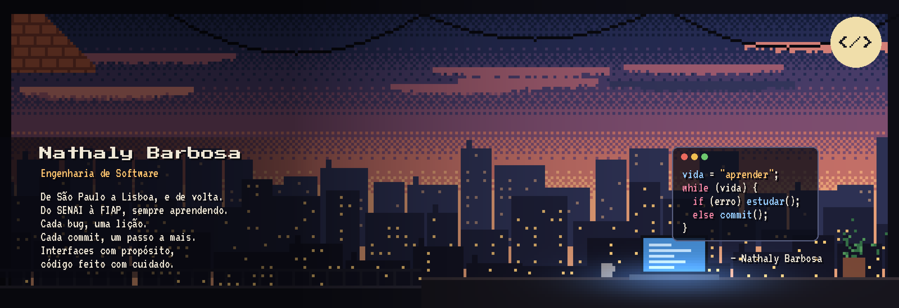

  

  <strong>Estudante de Engenharia de Software na FIAP</strong> · São Paulo, Brasil

  
  
  
  

---

## 👩‍💻 Sobre mim

Já estudei em três países, e em todos eles o código veio junto.

Minha primeira linha foi no **SENAI**, no curso de Análise e Desenvolvimento de Sistemas. Depois vieram um ano em **Missouri, nos EUA**, um ano de **Engenharia Informática em Lisboa** e, agora, **Engenharia de Software na FIAP**.

Gosto de transformar ideias em sistemas organizados e fáceis de usar, e de entender o porquê de cada linha de código. Foi assim que construí, na **Ensina Book**, o **sistema de gestão de vendas** que a equipe usa todos os dias.

🎯 Procurando **estágio em desenvolvimento** · aberta a **freelas**

 

## 🛠️ Tech Stack
 

  
   
  

## 📊 Estatísticas no GitHub

  
  

  

## 🎓 Formação

| Período | Curso | Instituição |
|---|---|---|
| 2026 – 2030 | Engenharia de Software | FIAP · São Paulo |
| 2025 – 2026 | Engenharia Informática | IADE · Lisboa, Portugal |
| 2024 – 2025 | Ensino Médio (intercâmbio) | Marshfield High School · Missouri, EUA |
| 2023 – 2024 | Análise e Desenvolvimento de Sistemas | SENAI · São Caetano do Sul |

## 👾 Pac-Man das contribuições

  <picture>
    <source media="(prefers-color-scheme: dark)" srcset="https://raw.githubusercontent.com/natyqueiroz/natyqueiroz/output/pacman-contribution-graph-dark.svg" />
    <source media="(prefers-color-scheme: light)" srcset="https://raw.githubusercontent.com/natyqueiroz/natyqueiroz/output/pacman-contribution-graph.svg" />
    
  </picture>

## 🌎 Idiomas

🇧🇷 Português (nativo) · 🇺🇸 Inglês (avançado)

---

Vamos conversar? Me chame no <a href="https://www.linkedin.com/in/nathaly-barbosa-2378032b0/">LinkedIn</a> ou por <a href="mailto:vnathy54@gmail.com">e-mail</a>.

